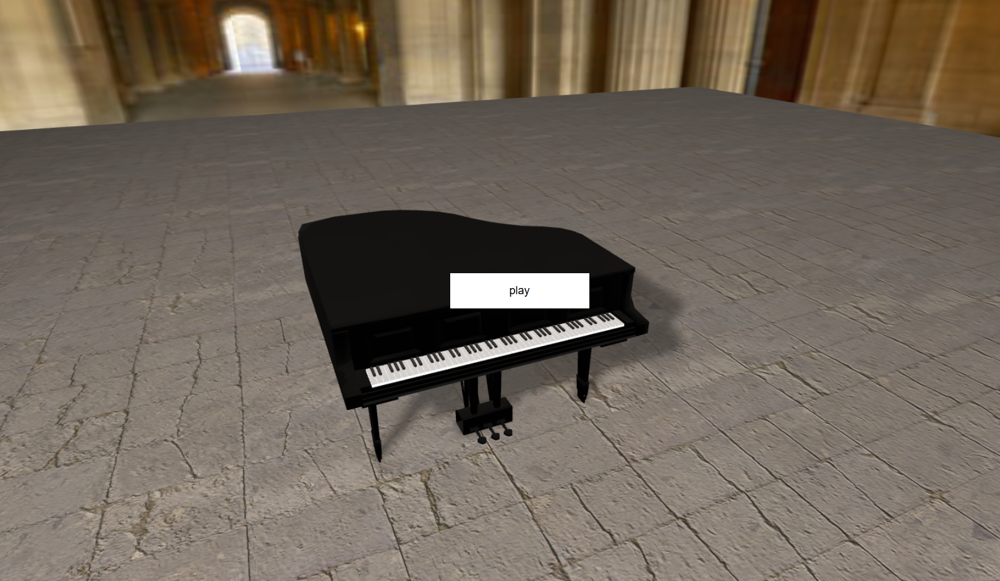

# 🌟 My Awesome Web Projects Repository 🌟

Welcome to my personal collection of diverse web projects! This repository serves as a showcase for various applications and games I've developed using technologies like Pug, HTML, CSS, SCSS, Stylus, JavaScript, and Babel. Feel free to explore, learn, and even contribute!

---

## 🚀 Projects Overview

Here's a quick look at the applications and games you'll find in this repository:

### 🎱 Billiard Play with AI

* **Introduction:** A classic billiard game where you can play against an AI opponent. It features interactive gameplay and demonstrates game logic implementation.
* **Screenshot:**
    * 

### 🎯 Bull Eye

* **Introduction:** [Briefly describe what this project is about, its main features, and what technologies it uses. For example: "A target-shooting game where players aim for the bullseye to score points, testing precision and timing."]
* **Screenshot:**
    * 

### 🍔 Burger Drum

* **Introduction:** [Briefly describe what this project is about, its main features, and what technologies it uses. For example: "A fun and interactive game where players assemble burgers by drumming or tapping, challenging their rhythm and speed."]
* **Screenshot:**
    * 

### 🏃 Chasing Game

* **Introduction:** A fast-paced arcade-style game where the player controls an entity that must chase or evade others. It focuses on dynamic movement and simple game mechanics.
* **Screenshot:**
    * 

### 🐶 Choose Your Dog

* **Introduction:** An interactive web application that allows users to browse and "choose" different dog breeds, potentially featuring information or images for each.
* **Screenshot:**
    * 

### 🐑 Counting Sheep

* **Introduction:** [Briefly describe what this project is about, its main features, and what technologies it uses. For example: "A relaxing application designed to help with sleep by visually counting sheep, featuring smooth animations and a calming interface."]
* **Screenshot:**
    * 

### 👑 Destroy King

* **Introduction:** A strategic or action-oriented game where the primary objective is to defeat a "king" figure, possibly involving puzzle-solving or combat elements.
* **Screenshot:**
    * 

### 🤸 Doodle Jump

* **Introduction:** [Briefly describe what this project is about, its main features, and what technologies it uses. For example: "A recreation of the classic 'Doodle Jump' game, where players control a character jumping on platforms to ascend as high as possible."]
* **Screenshot:**
    * 

### 📝 Flappy Text

* **Introduction:** A unique take on the popular "Flappy" game genre, where the player navigates through obstacles, possibly using text-based elements or a textual interface.
* **Screenshot:**
    * 

### 📱 iPhone Configuration

* **Introduction:** A front-end project simulating an iPhone's settings or configuration interface, showcasing UI/UX design, responsiveness, and interactive elements.
* **Screenshot:**
    * 

### 🎹 Piano

* **Introduction:** A virtual piano application that allows users to play musical notes interactively, likely using keyboard inputs or mouse clicks.
* **Screenshot:**
    * 

### 🧩 Puzzle Game

* **Introduction:** [Briefly describe what this project is about, its main features, and what technologies it uses. For example: "A versatile puzzle game featuring various types of challenges, such as sliding puzzles or jigsaw puzzles, designed to test logical thinking."]
* **Screenshot:**
    * 

### 🌉 Santa Bridge

* **Introduction:** A festive-themed game or simulation involving Santa Claus and a bridge, potentially a physics-based challenge or a holiday-themed puzzle.
* **Screenshot:**
    * 

### ☀️ Solar System

* **Introduction:** [Briefly describe what this project is about, its main features, and what technologies it uses. For example: "A captivating simulation of our solar system, showcasing planetary orbits and celestial bodies with interactive controls."]
* **Screenshot:**
    * 

### 📦 Stack Game

* **Introduction:** [Briefly describe what this project is about, its main features, and what technologies it uses. For example: "A challenging game where players must strategically stack blocks to build the highest tower possible without it toppling over."]
* **Screenshot:**
    * 

### 🔢 Sudoku Game

* **Introduction:** A classic Sudoku puzzle game implemented with a clean user interface, offering a digital way to play and solve Sudoku puzzles.
* **Screenshot:**
    * 

### 🎸 Synth from Hell - Phone-tablet-pc ver

* **Introduction:** A versatile music synthesizer application designed for cross-device compatibility (phones, tablets, and PCs), allowing users to create and manipulate sounds.
* **Screenshot:**
    * 

### 🚂 Train puzzle

* **Introduction:** [Briefly describe what this project is about, its main features, and what technologies it uses. For example: "A logic puzzle game where players arrange train tracks to guide a train to its destination, challenging spatial reasoning."]
* **Screenshot:**
    * 

### 🌊 Water Surface

* **Introduction:** A project demonstrating the simulation or visual rendering of a water surface, potentially showcasing physics effects or advanced graphical techniques.
* **Screenshot:**
    * 

### 🖥️ Windows 10 simulator

* **Introduction:** [Briefly describe what this project is about, its main features, and what technologies it uses. For example: "A front-end simulation of the Windows 10 desktop environment, showcasing UI elements and basic interactive features."]
* **Screenshot:**
    * 

---

## 🛠️ How to Use/Run These Projects

### Running Locally with a Simple Server

For most web projects, you'll need a local server to run them properly (especially for features like AJAX requests or certain browser security policies).

1.  **Clone the repository:**
    ```bash
    git clone [https://github.com/dannz510/Web-Project.git](https://github.com/dannz510/Web-Project.git)
    ```
2.  **Navigate to the project directory:**
    ```bash
    cd Web-Project/ProjectName
    ```
    (Replace `ProjectName` with the actual folder name of the project you want to run, e.g., `Billiard play with AI`)
3.  **Install a simple HTTP server (if you don't have one):**
    If you have Node.js and npm installed, you can use `http-server`:
    ```bash
    npm install -g http-server
    ```
4.  **Start the server:**
    From within the project's root directory (e.g., `Billiard play with AI/` or `Choose your dog/public/`), run:
    ```bash
    http-server
    ```
    This will typically start a server at `http://localhost:8080` (or another available port). Open your browser and navigate to the displayed URL.

### Directly from Browser (Live Demos)

You can also view live demos of most projects directly in your browser using `raw.githack.com`, which serves raw GitHub files with proper content types.

* **Choose your dog:** [🐶🎨](https://raw.githack.com/dannz510/Web-Project/refs/heads/main/Choose%20your%20dog/public/index.html)
* **Billiard Play with AI:** [🎱🤖](https://raw.githack.com/dannz510/Web-Project/refs/heads/main/Billiard%20play%20with%20AI/src/index.html)
* **Chasing Game:** [🐺🐰](https://raw.githack.com/dannz510/Web-Project/refs/heads/main/Chasing%20Game/index.html)
* **Destroy King:** [⚔️👑](https://raw.githack.com/dannz510/Web-Project/refs/heads/main/Destroy%20king/index.html)
* **Flappy Text:** [🐦💬](https://raw.githack.com/dannz510/Web-Project/refs/heads/main/Flappy%20Text/index.html)
* **iPhone Configuration:** [📱🎨](https://raw.githack.com/dannz510/Web-Project/refs/heads/main/Iphone%20configuration/index.html)
* **Piano:** [🎹🎵](https://raw.githack.com/dannz510/Web-Project/refs/heads/main/Piano/index.html)
* **Santa Bridge:** [🎅🏻🌉](https://raw.githack.com/dannz510/Web-Project/refs/heads/main/Santa%20Bridge/index.html)
* **Sudoku Game:** [🔢🧮](https://raw.githack.com/dannz510/Web-Project/refs/heads/main/Sudoku%20game/index.html)
* **Synth from Hell - Phone-tablet-pc ver:** [🎼🎶](https://raw.githack.com/dannz510/Web-Project/refs/heads/main/Synth%20from%20hell%20-%20Phone-tablet-pc%20ver/index.html)
* **Water Surface:** [💧🌊](https://raw.githack.com/dannz510/Web-Project/refs/heads/main/Water%20Surface/index.html)
* **Bull Eye:** [🎯🏹](https://raw.githubusercontent.com/dannz510/Web-Project/refs/heads/main/Bull%20Eye/index.html)
* **Burger Drum:** [🍔🥁](https://raw.githubusercontent.com/dannz510/Web-Project/refs/heads/main/Burger%20Drum/index.html)
* **Counting Sheep:** [🔄️🐏](https://raw.githubusercontent.com/dannz510/Web-Project/refs/heads/main/Counting%20Sheep/index.html)
* **Doodle Jump:** [👽🦘](https://raw.githubusercontent.com/dannz510/Web-Project/refs/heads/main/Doodle%20Jump/index.html)
* **Puzzle Game:** [🧩🧩](https://raw.githubusercontent.com/dannz510/Web-Project/refs/heads/main/Puzzle%20Game/index.html)
* **Solar System:** [🌌🌟](https://raw.githubusercontent.com/dannz510/Web-Project/refs/heads/main/Solar%20System/index.html)
* **Stack Game:** [🧱🧩](https://raw.githubusercontent.com/dannz510/Web-Project/refs/heads/main/Stack%20Game/index.html)
* **Train puzzle:** [🚆🧩](https://raw.githubusercontent.com/dannz510/Web-Project/refs/heads/main/Train%20puzzle/public/index.html)
   * **Windows 10 simulator:**
+ VER 1: [🪟](https://raw.githubusercontent.com/dannz510/Web-Project/refs/heads/main/Windows%2010%20simulator/DZOS/indexver1.html)
* **Windows 10 simulator:**
   + VER 4: [🪟](https://raw.githubusercontent.com/dannz510/Web-Project/refs/heads/main/Windows%2010%20simulator/DZOS/indexver4.html)


---

## 🤝 Contributing

Contributions are always welcome! If you have suggestions, bug reports, or want to add new features, please feel free to:

1.  Fork the repository.
2.  Create a new branch (`git checkout -b feature/YourFeature`).
3.  Make your changes.
4.  Commit your changes (`git commit -m 'Add some feature'`).
5.  Push to the branch (`git push origin feature/YourFeature`).
6.  Open a Pull Request.

## 📄 License

This project is licensed under the [MIT License](https://github.com/dannz510/Web-Project/blob/main/LICENSE).

## 📞 Contact

If you have any questions or feedback, feel free to reach out:

* **GitHub:** [danzz510](https://github.com/danzz510)
* **Gmail:** [mini51019158@gmail.com](https://mail.google.com/mail/u/0/)
